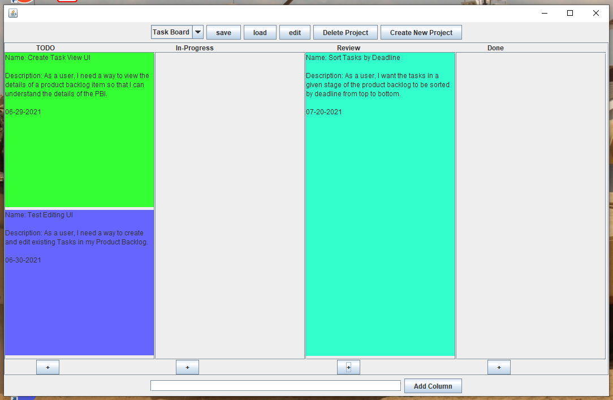
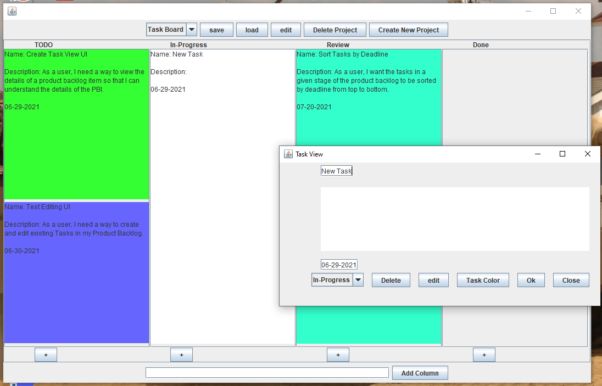
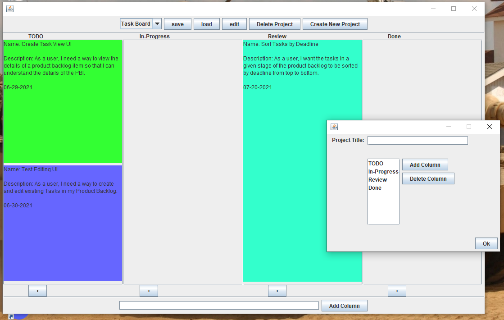
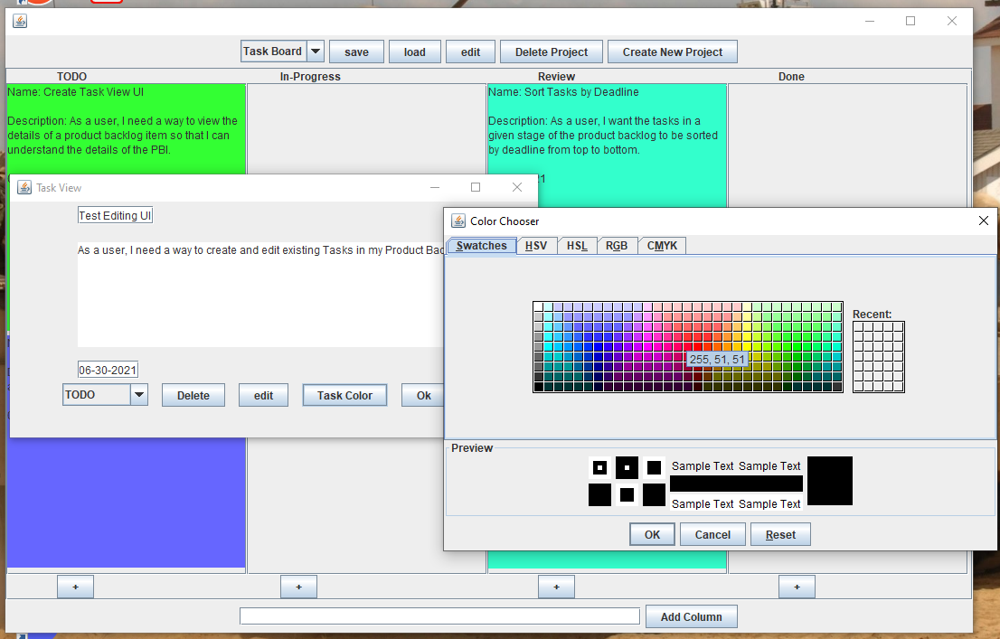

# CS-151-Final-Project
TaskBoard creation for CS 151

## Description
The goal of this project was to create a basic digital task board that a member of a development team could use to create and track product backlog items as they move through the development process. It was developed by a 3 member team of college students. The GUI was designed using the Spring library.

## Features
* Ability to create and manage multiple task boards for different projects
* Ability to create new columns in a task board to represent different stages of your development pipeline
* Tasks can be moved between columns via Drag and Drop
* The color of tasks can be customized
* Task boards can be saved in .xml format
* Tasks are automatically sorted according to deadline date within a given column

# Gallery
<table>
  <tr>
    <td>
      
    </td>
    <td>
      
    </td>
  </tr>
   <tr>
    <td>
      
    </td>
    <td>
      
    </td>
  </tr>
</table>
